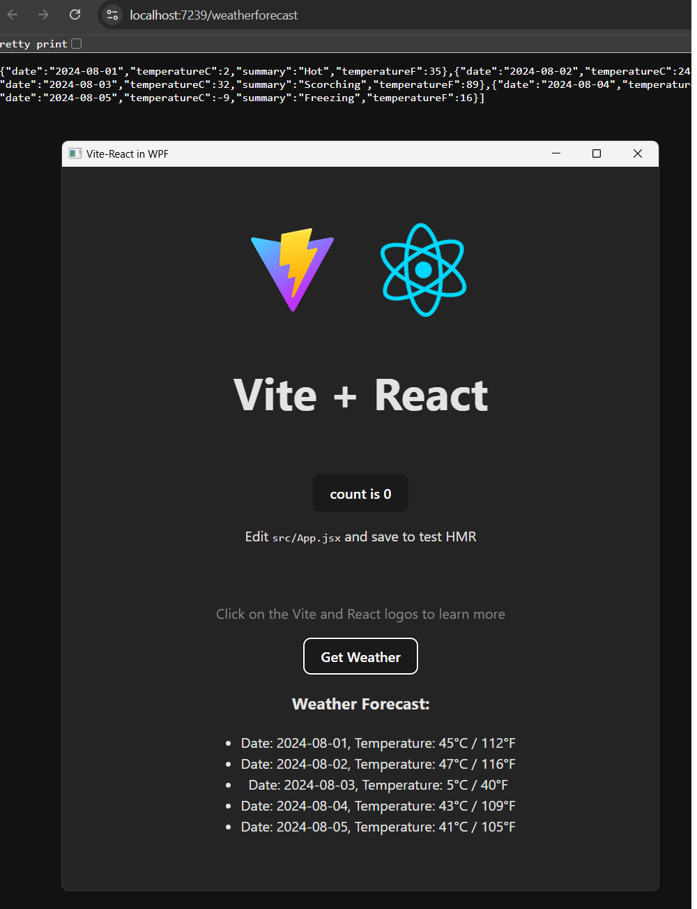

# WPF Vite React Host

This project demonstrates how to host a Vite-built React application within a WPF application using WebView2. ASP.NET is not required, there is just an ASP Core project to show how you can use an API.



## Features

- WPF application serving as a host for a React app
- React app built with Vite for fast development and optimized production builds
- WebView2 integration for rendering the React app within WPF
- Example of fetching data from an ASP.NET Core Web API

## Prerequisites

- .NET Framework or .NET Core (version used in the project)
- Node.js and npm (for React development)
- WebView2 Runtime

## Getting Started

1. Clone the repository
2. Navigate to the React app directory and run:

    ```sh
    pnpm install
    pnpm run build
    ```

3. Copy all the files in dist into the ReactApp folder. Set each file to copy to ouput directory, copy if newer in Visual Studio.

## How It Works

The WPF application uses WebView2 to load the React application. The React app is built and its output is placed in a directory that the WPF app can access. WebView2 is configured to use a virtual host, allowing the React app to make API calls without CORS issues.
